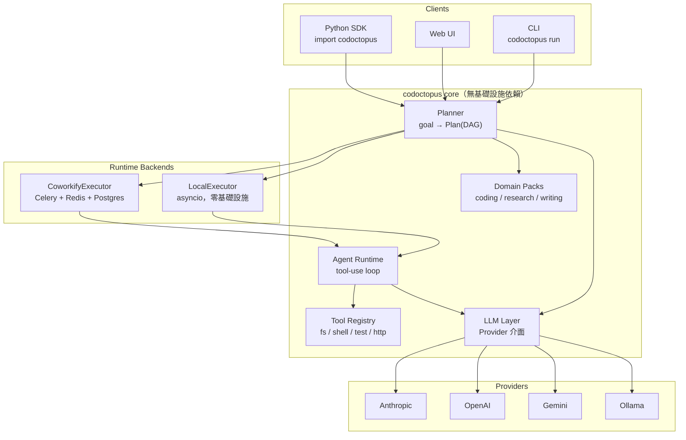

# Codoctopus v2 — 架構設計

> 狀態：草案，待實作
> 分支：`v2`（自 `refactor` 分出）
> 撰寫日期：2026-09-05

---

## 1. 為什麼要重寫

v1（`main`，V10.1.0.0）與 `refactor` 分支已經把三個 Flask server 併成單一 app、secrets 移到環境變數。結構清理過了，但讓專案「只能做一件事」的五個癥結一個都沒解：

| # | 癥結 | 位置 | 後果 |
|---|---|---|---|
| 1 | 綁死單一供應商 | v1 `Generate_Server.py:78-89`（三把 OpenAI key）、refactor `services/ai_service.py`（改綁 Gemini） | 換模型＝改程式；無法比較模型；無法用本地模型 |
| 2 | 用自然語言格式當協定 | `Config.yaml` 的 `WORKSHEET_FORMAT` / `GROUPED_FORMAT`，`extract_worksheet_content()` 逐行 `startswith` 切字串 | 模型一不照格式輸出整條 pipeline 就崩，且無法偵錯 |
| 3 | Agent 沒有工具 | `employee_work()` 只把上一棒的文字塞給下一棒 | 不能執行、不能驗證。「自動驗證層」實際上是再叫一次 LLM 看一眼 |
| 4 | 領域寫死在 prompt | 角色全是 `CODE_MASTER` / `ANALYST` / `PRESENTER`，worksheet 預設產出 source code | 只能寫程式。換領域＝重寫整份 config |
| 5 | 自幹的 DAG 執行器 | `classify_all_jobs()` 用 LLM 分組 + `threading.Barrier` 分層跑 | 無重試、無持久化、無可觀測性；process 掛掉從頭來 |

第 5 點特別可惜——[Coworkify](https://github.com/ccoliu/coworkify) 已經把這件事做完了，而且做得更好。

---

## 2. 設計目標

1. **供應商中立** — 換模型是改一行設定，不是改程式
2. **結構化協定** — 步驟之間傳 typed object，不傳待解析的散文
3. **Agent 能動手** — 可執行程式、讀寫檔案、跑測試、查資料；驗證是真的跑過
4. **領域可插拔** — coding 只是其中一個 domain pack，不是唯一
5. **執行交給 Coworkify** — 排程、重試、持久化、即時推播不自己寫

另加一條非功能目標：**核心可獨立使用**。`pip install codoctopus` 後不需要任何基礎設施就能跑；Web UI 與 Coworkify 都只是外掛的 client / backend。

---

## 3. 分層架構



核心規則：**依賴只能由外往內**。`core` 不 import Flask、不 import Celery、不 import requests-to-coworkify。Runtime backend 依賴 core，core 不知道 runtime 的存在。

---

## 4. 套件結構

```
codoctopus/
├── llm/
│   ├── types.py          # Message, ToolSpec, ToolCall, Usage, Completion
│   ├── base.py           # Provider 抽象介面
│   ├── registry.py       # "anthropic:claude-opus-5" → Provider 實例
│   └── providers/
│       ├── anthropic.py  # 預設；tool_runner + output_config.format
│       ├── openai.py
│       ├── gemini.py
│       └── ollama.py
├── tools/
│   ├── base.py           # Tool ABC：name / description / schema / run()
│   ├── registry.py       # 可註冊自訂工具
│   ├── filesystem.py     # read / write / list，限制在 workspace 內
│   ├── shell.py          # 沙箱執行，allowlist + timeout
│   ├── testing.py        # 跑測試並回傳結構化結果
│   └── http.py           # 沿用 Coworkify 的 SSRF 防護
├── agents/
│   ├── agent.py          # Agent = role + tools + output_schema；tool-use loop
│   └── memory.py         # 步驟間的 artifact 傳遞
├── planning/
│   ├── models.py         # Plan / PlanStep（pydantic）
│   ├── planner.py        # goal → Plan，走 structured output
│   └── validate.py       # 環偵測、依賴檢查、fan-in 檢查
├── domains/
│   ├── base.py           # Domain：roles / tools / artifact / verifier
│   ├── coding.py         # 移植 v1 的 CODE_MASTER 等角色
│   ├── research.py
│   └── writing.py
├── runtime/
│   ├── base.py           # Executor 介面
│   ├── local.py          # asyncio DAG 執行
│   └── coworkify.py      # Plan → WorkflowCreate，POST 給 Coworkify
├── config.py             # pydantic-settings，env 驅動
└── cli.py
```

---

## 5. 核心介面

### 5.1 Provider（供應商中立的關鍵）

介面刻意只留三個能力，讓每家都能誠實實作：

```python
class Provider(Protocol):
    async def complete(
        self,
        messages: list[Message],
        *,
        system: str | None = None,
        tools: list[ToolSpec] | None = None,
        output_schema: type[BaseModel] | None = None,
        max_tokens: int = 16000,
    ) -> Completion: ...

    @property
    def supports_tools(self) -> bool: ...

    @property
    def supports_structured_output(self) -> bool: ...
```

`Completion` 統一回傳 `text` / `tool_calls` / `parsed`（structured output 的結果）/ `usage`。各家 SDK 的差異全部吸收在 adapter 內：

- **Anthropic**（預設）— `client.messages.create()`，`thinking={"type": "adaptive"}`、`output_config={"effort": ...}`、structured output 走 `output_config.format`，工具用 `strict: true`。預設模型 `claude-opus-5`
- **OpenAI** — `chat.completions` + `response_format`
- **Gemini** — `google-genai`，`response_schema`
- **Ollama** — 本地模型；`supports_structured_output` 視模型回報

不支援 structured output 的 provider，由 core 自動退回「JSON mode + 驗證重試」，而不是回到 v1 的字串切割。

### 5.2 Plan（取代 WORKSHEET_FORMAT）

v1 讓 LLM 吐一段散文再切；v2 讓 LLM 直接產出這個 schema：

```python
class PlanStep(BaseModel):
    key: str                          # 本地識別碼
    name: str
    role: str                         # domain 提供的角色
    instruction: str
    depends_on: list[str] = []
    tools: list[str] = []             # 這一步允許用的工具
    for_each: str | None = None       # 動態展開來源
    output_schema: str | None = None

class Plan(BaseModel):
    goal: str
    domain: str
    steps: list[PlanStep]
```

好處：格式錯誤在 API 層就被擋下，不會流進 pipeline；`Plan` 可以序列化、存檔、diff、重跑；驗證（環偵測、依賴存在性）是純函式，可單元測試，不需要呼叫模型。

### 5.3 Tool

```python
class Tool(ABC):
    name: str
    description: str
    schema: type[BaseModel]

    @abstractmethod
    async def run(self, args: BaseModel, ctx: ToolContext) -> ToolResult: ...
```

`ToolContext` 帶 workspace 路徑與資源上限。所有檔案操作限制在 workspace 內，shell 有 allowlist 與 timeout。

### 5.4 Domain（取代寫死的角色表）

```python
class Domain(ABC):
    name: str
    roles: dict[str, str]             # 角色名 → system prompt
    default_tools: list[str]
    planner_hint: str                 # 怎麼拆解這個領域的任務
    async def verify(self, artifact, ctx) -> VerifyResult: ...
```

`coding` domain 的 `verify()` 是真的跑測試；`research` 的 `verify()` 是檢查引用來源是否可達。v1 的角色與 format 全部移植成 `domains/coding.py`，不會弄丟既有能力。

---

## 6. Coworkify 整合

Coworkify 現成可用的部分比預期多：`task_type` → handler 路由、DAG `depends_on`、環偵測、`for_each` 動態展開（`{{item.欄位}}` 樣板）、指數退避重試、下游串連取消、Redis pub/sub → WebSocket 即時推播。

`Plan` → `WorkflowCreate` 幾乎是一對一映射。但有**三個缺口**必須先在 Coworkify 補上：

### 缺口 A：步驟之間無法傳遞結果

目前 `payload` 只有 `for_each` 的 `{{item}}` 可用；下游步驟拿不到上游的 `result`。Agent 鏈幾乎每一步都需要。

**補法**：新增 `{{steps.<key>.result}}` / `{{steps.<key>.result.<欄位>}}` 樣板，派送前從 `TaskLog` 取上游結果渲染。渲染時機在 `executor.advance_workflow()` 派送下游之前。

### 缺口 B：不支援 fan-in / reduce

`schemas/workflow.py` 的驗證器明確擋掉（「目前不支援 fan-in/reduce」）。但 Codoctopus 的 worksheet 最後一步固定是「把所有完成的工作合併起來」——沒有 fan-in 就做不出來。

**補法**：新增 `reduce_of: <for_each step key>`，等該組動態展開的所有 task 完成後，把結果收成 list 派送一個彙整 task。

### 缺口 C：沒有 agent task type

**補法**：在 `TASK_REGISTRY` 加入 `agent_step`，payload 帶 `{role, instruction, tools, model, output_schema}`，handler 呼叫 `codoctopus.agents.Agent` 執行。Coworkify worker 需要能 import codoctopus core。

> 這三項對 Coworkify 本身也是正向補強（結果傳遞與 reduce 是通用需求，不是為了 Codoctopus 特化），適合當成獨立 PR 進 coworkify repo。

---

## 7. 里程碑

| 階段 | 內容 | 產出 |
|---|---|---|
| **M1** | LLM 層 + Provider adapters + tool registry | `codoctopus.llm` 可換供應商跑通 |
| **M2** | Agent runtime（tool-use loop）+ 基礎工具 | Agent 能讀檔、跑程式、回報結構化結果 |
| **M3** | Planner + Plan schema + 驗證 + `LocalExecutor` | `codoctopus run "..."` 端到端可跑，零基礎設施 |
| **M4** | Domain packs：coding（移植 v1）/ research / writing | 證明領域可插拔 |
| **M5** | Coworkify 三個缺口 + `CoworkifyExecutor` | 同一份 Plan 可切換 local / 分散式執行 |
| **M6** | Web UI 接新 API；v1 的 plagiarism / community / tickets 掛回來 | 功能不退步 |

M1–M3 是骨幹，做完就有一個能對外展示的通用 agent 框架。M4 之後是加值。

---

## 8. 對 v1 既有功能的處理

| v1 功能 | v2 去向 |
|---|---|
| 任務拆解 / 分組 / 分層執行 | Planner + Plan，取代 LLM 分組 + `threading.Barrier` |
| 角色與 prompt 格式 | 移植成 `domains/coding.py` |
| 抄襲偵測（AST + Levenshtein） | 保留，包成 `tools/plagiarism.py`，可被任何 agent 呼叫 |
| Ticket / community / 登入 | 沿用 `refactor` 分支的 blueprint，暫不動 |
| Fine-tune 資料收集 | 暫時擱置，v2 的結構化 trace 是更好的資料來源 |
